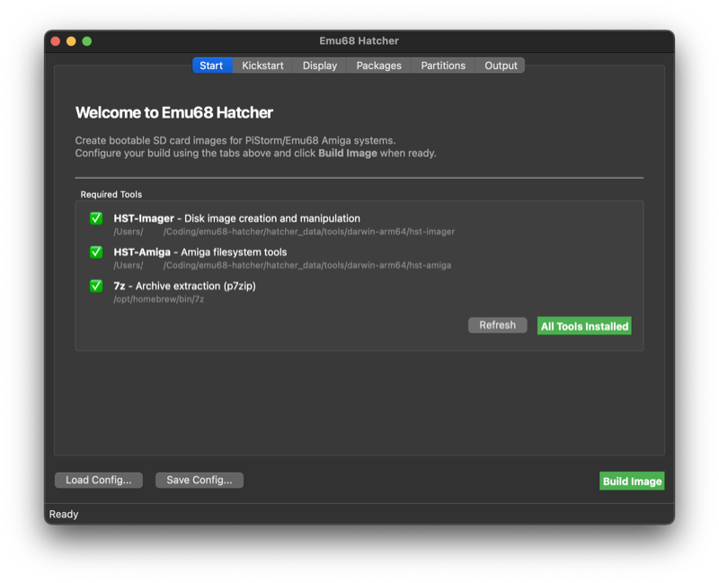
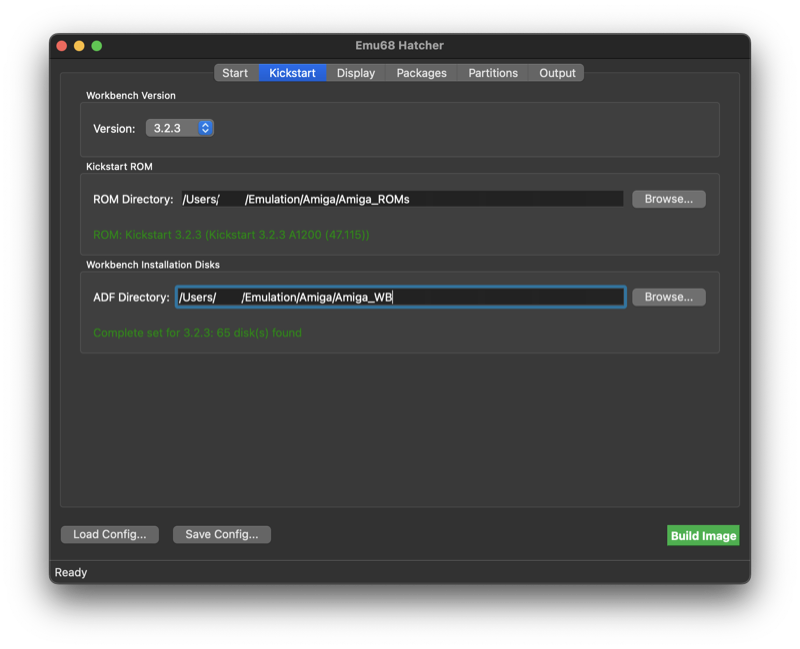
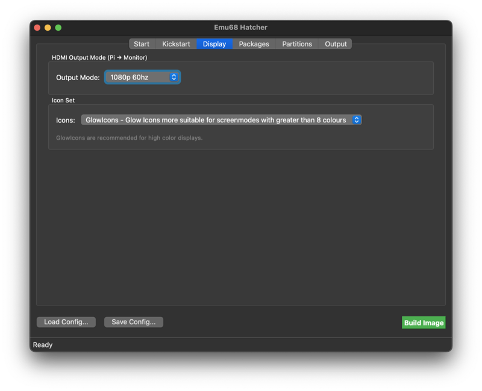
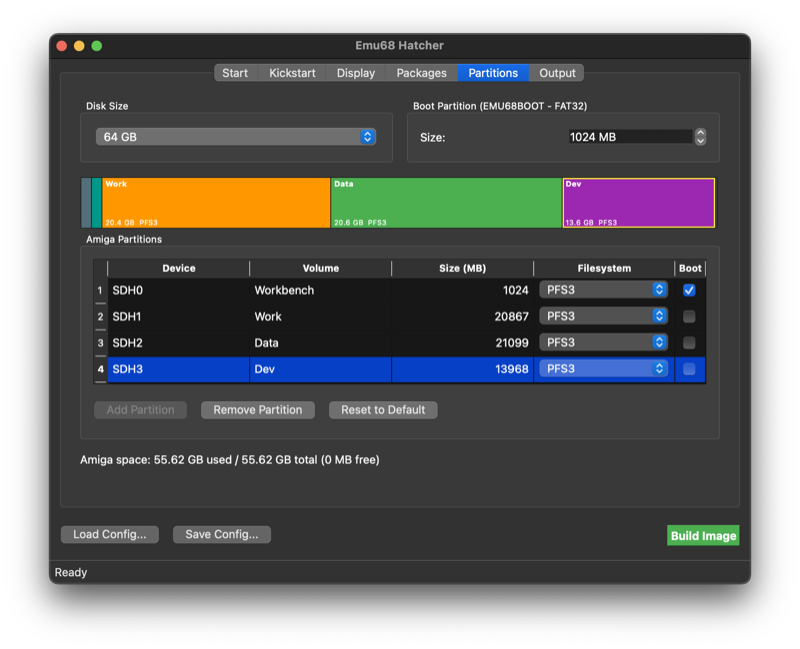
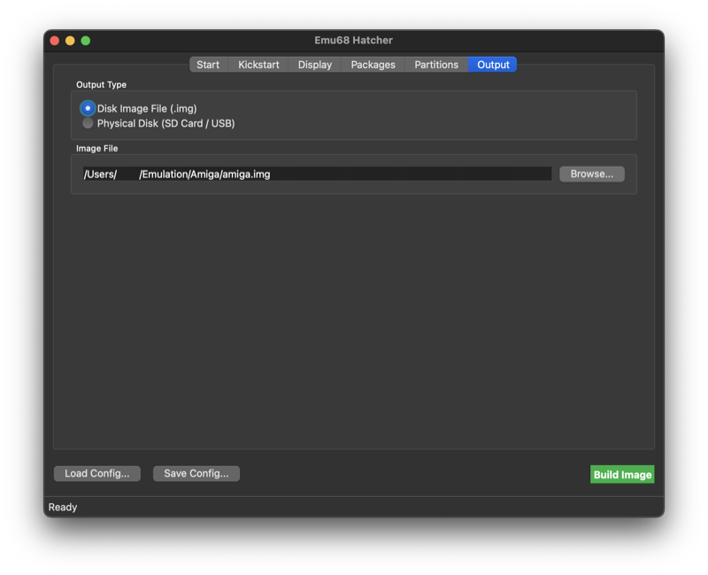
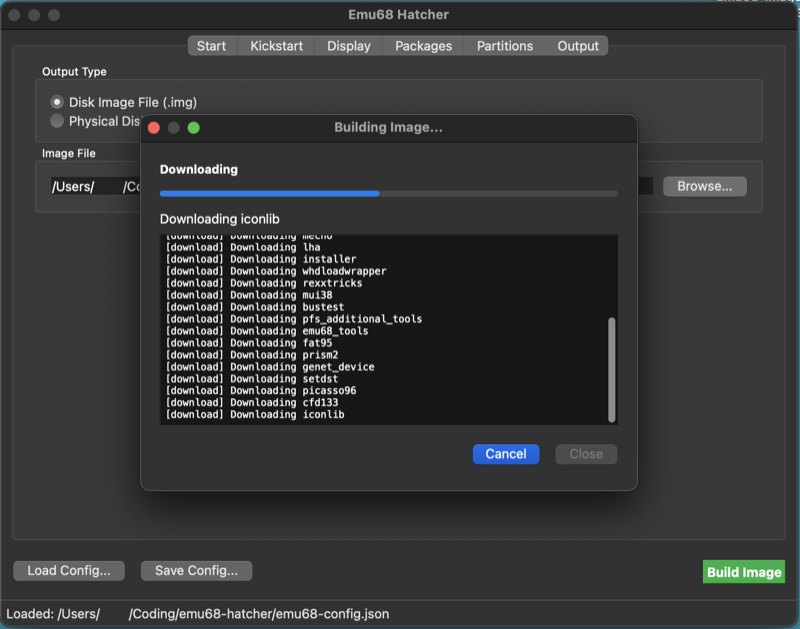

#  emu68-hatcher

cross-platform app to build sd card images for pistorm/emu68 amiga systems, similar to [Emu68-Imager](https://github.com/mja65/Emu68-Imager-Software)

designed to run cross-platform with a simple Qt GUI and CLI



1. [⚠️ important / state of the project](#1--important--state-of-the-project)
2. [system requirements](#2-system-requirements)
3. [install](#3-install)
   - [3.1 pre built app bundle (.dmg)](#31-pre-built-app-bundle-dmg)
   - [3.2 from source (linux, windows, macos)](#32-from-source-linux-windows-macos)
4. [usage](#4-usage)
   - [4.1 GUI](#41-GUI)
   - [4.2 CLI](#42-CLI)
5. [flashing to sd](#5-flashing-to-sd)
6. [credits](#6-credits)
7. [license](#7-license)

## 1. ⚠️ important / state of the project
I only have one Amiga1200 with pistorm32-lite/CM4 and couldn't test everything in emulation so this is still pretty untested. the basic workflow is there and it can build a working image

- **flashing to sd card is WIP and currently only works when using the CLI** (the images can of course be flashed with any existing flasher)
- **you need too have enough free space on your harddrive to build the full-sized image** the build process creates a temporary file with the full size of the output image, so if you're using a 32gb sd card you need 32gb free space. sparse image file support is definitely on the roadmap tho.
- **workbench 3.9 not supported yet.** pick 3.1, 3.2, 3.2.2.1, or 3.2.3
- **mostly tested on 3.2.3.** the other versions should work too but have not been tested as much
- **ethernet (`genet`) connection is untested** (my eth port does not work)
- **only PFS3** for now, FFS is still broken
- **.app bundle is unsigned and not notarised.** gatekeeper blocks it on first launch, see [3.1 install](#31-pre-built-app-bundle-dmg) for the bypass

feedback and bug reports are very welcome, just open an issue, send a mail (emu68hatcher@rootroot.de) or a message on discord (rootroot4256)

## 2. system requirements

- macos 12+ (apple silicon, possibly intel) - the .app bundle includes python, no separate install needed
- linux (recent ubuntu/debian, fedora, arch...) - needs python 3.10+ installed
- a sd card, 4 gb minimum, 32+gb recommended

## 3. install

since my only dev system right now is a macbook, there only is a pre-built "app" (bundle) for macos. on linux and windows (and macos, if you prefer) you can run it from source.

### 3.1 pre built app bundle (.dmg)

download latest `Emu68 Hatcher.dmg` from the [releases](https://github.com/rootrootde/emu68-hatcher/releases) page, open it and drag the app into `/Applications`

because an apple developer account is expensive and the app is free, the .app is unsigned, so gatekeeper will block it on first launch!

to bypass, run in a terminal (password required):

```bash
sudo xattr -dr com.apple.quarantine "/Applications/Emu68 Hatcher.app"
```

this removes the quarantine attribute and lets the app launch normally from then on. `sudo` because by default `/Applications` is owned by root

(alternatively, on older macos up to sonoma 14(?) you could right click the app → open → open and click through the "unidentified developer" dialog. apple removed that shortcut in sequoia 15 - you'd have to go to system settings → privacy & security and click "open anyway" after the first blocked launch, but the one liner above is easier)

### 3.2 from source (linux, windows, macos)

no pre-built bundles for linux or windows yet, but the python sources run anywhere with python 3.10+ (the .app bundle ships its own python, so this is only needed for source installs).

grab the source tarball from the [releases](https://github.com/rootrootde/emu68-hatcher/releases) page (or clone the repo if you want the latest):

```bash
# from a release tarball
tar xf emu68-hatcher-<version>.tar.gz
cd emu68-hatcher-<version>

# or from git
git clone https://github.com/rootrootde/emu68-hatcher.git
cd emu68-hatcher

python3 -m venv .venv
source .venv/bin/activate          # windows: .venv\Scripts\activate
pip install -e ".[gui]"
python -m emu68hatcher gui         # or any other subcommand
```

use `python -m emu68hatcher ...` to invoke the CLI

there's also a `emu68-hatcher` console script registered by pip, but depending on your shell you may need to `hash -r` (bash/zsh) or open a new terminal after `pip install` before it's picked up


## 4. usage

### 4.1 GUI

1. launch the app, it will check if some required tools are installed
2. if required tools are shown as missing, click **download missing tools**, wait for green checkmarks. if 7z fails try brew: `brew install p7zip` and hit refresh
3. kickstart tab: pick the workbench version to install. select the folder containing the ROMs. emu68-hatcher will automatically look in the same folder for the workbench ADF files but you can also point it somewhere else

   

4. display tab: pick the HDMI output mode for your monitor and the icon set (GlowIcons (only 3.2+) or Standard)

   
5. packages tab: enable/disable optional packages. mandatory system packages are always included and not shown here
6. partitions tab: configure disk size and partition layout. default is a 64gb image with a ~4gb Workbench partition and the rest labeled as "Work". you can add/remove/resize partitions, drag the borders on the partition bar to resize them (or type exact sizes)

   

7. output tab: pick **image file** (not disk, see [state of the project](#1-%EF%B8%8F-important--state-of-the-project)), pick a destination folder and filename

   
8. click **build image**. first build downloads a bunch of packages (uses cache after that)

   

9. flash the image to the sd card (see [5. flashing to sd](#5-flashing-to-sd))

you can save the current configuration to a json file via **save config** (bottom left) and load it later with **load config**

### 4.2 CLI

from a source install, `python -m emu68hatcher ...` inside the active venv always works. the `emu68-hatcher` console script is also registered by pip but see the note in the install section

from the macos .app bundle, click **install CLI helper…** on the start tab and it drops a wrapper into `~/.local/bin/`. if that dir isn't on your `$PATH`, stick `export PATH="$HOME/.local/bin:$PATH"` in your shell rc (`~/.zshrc`, `~/.bashrc` or whatever you use) and open a new terminal

```bash
emu68-hatcher --help              # all commands
emu68-hatcher status              # platform + tool check
emu68-hatcher list-drives         # find your sd card
emu68-hatcher build config.json   # build from a saved config
emu68-hatcher flash image.img /dev/diskN
...
```

## 5. flashing image to sd

direct flashing to sd card from the GUI is not working yet (see [state of the project](#1-%EF%B8%8F-important--state-of-the-project)). use the CLI instead:

```bash
emu68-hatcher list-drives
emu68-hatcher flash ~/path/to/amiga.img /dev/diskN
```

plug in your sd card and run `emu68-hatcher list-drives` (or `diskutil list` on macos / `lsblk` on linux) to find the device path. the `N` in `/dev/diskN` is the disk number shown there (e.g. `/dev/disk4`)

⚠️⚠️**DOUBLE-CHECK THIS** - `DD` WRITES RAW TO WHATEVER YOU POINT IT AT, PICKING THE WRONG DISK WILL WIPE/OVERWRITE IT!⚠️⚠️

asks for your admin password because it runs `sudo dd` under the hood

or, since the build output is a plain disk image, use any existing flashing software like:

- [balena etcher](https://etcher.balena.io/) - macos, linux, windows
- [raspberry pi imager](https://www.raspberrypi.com/software/) - macos, linux, windows)
...

## 6. credits

this project would have never been possible without [mja65](https://github.com/mja65)'s work on the fantastic [emu68 imager](https://github.com/mja65/Emu68-Imager-Software) project. the code in this repo borrows heavily from emu68 imager, and the overall design and workflow is very similar.

it's not intended to replace emu68-imager, but rather as an alternative for macos and linux users. and a hobby project for me to brush up on my python.

built on top of [emu68](https://github.com/michalsc/Emu68) (michal schulz) and [hst imager](https://github.com/henrikstengaard/hst-imager) / [hst amiga](https://github.com/henrikstengaard/hst-amiga) (henrik stengaard).


## 7. license

see [LICENSE](./LICENSE)
