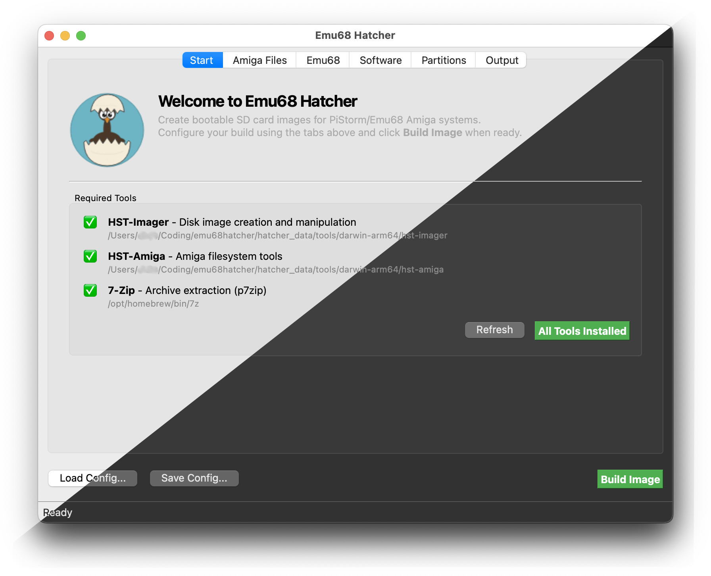

#  Emu68 Hatcher

Build ready-to-run SD cards with pre-configured Workbench installation (+batteries included) for [PiStorm](https://github.com/captain-amygdala/pistorm)-accelerated Amigas. 

Runs on macOS, Linux and Windows.



> [!NOTE]
> **Still in an early stage** - see [known issues](https://rootrootde.github.io/emu68hatcher/#known-issues-limitations). Only actively tested on my A1200 + pistorm32-lite + CM4 / on macOS. If you run it on different hardware or OS, let me know on the [Discord](https://discord.com/invite/ApTbasXJPE) or open a [GitHub issue](https://github.com/rootrootde/emu68hatcher/issues) - even just "it worked" is useful.

**Features**

- Bootable Emu68 install for pistorm32-lite, pistorm, pistorm16
- Workbench install from stock ADFs (3.1 / 3.2 / 3.2.2.1 / 3.2.3)
- Customizable package set: MUI, WHDLoad+WHDLoadWrapper, IBrowse, HippoPlayer, ...
- RTG (Picasso96), networking (Roadshow TCP/IP stack + wifipi/genet drivers), partition layout editor (PFS3 + FFS)
- SD card flashing (direct, or write the **.img** to a card after the build), sparse **.img** by default
- Build configs as JSON (save / load)

→ see [docs](https://rootrootde.github.io/emu68hatcher/) for more

## Quickstart

### 1. Download

From [releases](https://github.com/rootrootde/emu68hatcher/releases):

- **macOS:** emu68hatcher-VERSION-macos-arm64.dmg (or -macos-x64.dmg on Intel)
- **Linux** (Debian / Ubuntu): emu68hatcher-VERSION-linux-x64.deb (or -arm64.deb)
- **Windows:** emu68hatcher-VERSION-windows-x64.exe (or -arm64.exe)

### 2. Install

- **macOS:** drag Emu68 Hatcher.app into /Applications
- **Linux:** sudo apt install ./emu68hatcher-\*-linux-\*.deb
- **Windows:** run the .exe installer

### 3. Launch

- **macOS:** open Emu68 Hatcher from /Applications. First run: grant Full Disk Access to **hst-imager** so SD card writes work - see the [installation guide](https://rootrootde.github.io/emu68hatcher/installation/#macos).
- **Linux:** emu68hatcher
- **Windows:** from the Start menu

## From source (any OS, Python 3.10+)

```bash
git clone https://github.com/rootrootde/emu68hatcher.git
cd emu68hatcher
python3 bootstrap.py            # windows: python bootstrap.py
emu68hatcher                    # windows: python -m emu68hatcher
```

For usage see → [docs](https://rootrootde.github.io/emu68hatcher/).

## Credits

Thanks to:

- [mja65](https://github.com/mja65)'s fantastic work on the [Emu68 Imager](https://github.com/mja65/Emu68-Imager-Software) project
- [Emu68](https://github.com/michalsc/Emu68) and [Emu68-tools](https://github.com/michalsc/Emu68-tools) by Michal Schulz (MPL-2.0)
- [hst-imager](https://github.com/henrikstengaard/hst-imager) and [hst-amiga](https://github.com/henrikstengaard/hst-amiga) by Henrik Stengaard (MIT) - disk image + RDB tooling

Bundled / downloaded at build time:

- [WHDLoad](http://whdload.de/) by Bert Jahn - donationware; please [donate](http://whdload.de/whdload/donations.html) if you use it
- [Roadshow Demo](https://www.amigashop.org/product_info.php?cPath=2_34&products_id=200&language=de) bundled with permission from A. Magerl (APC&TCP)
- [7-Zip](https://github.com/ip7z/7zip) (GNU LGPL) - downloaded at install time, License.txt copied alongside the binary
- Aminet packages (MUI, HippoPlayer, IBrowse, akDatatypes, Picasso96, ...) - downloaded from [aminet.net](https://aminet.net) at build time

## License

[LICENSE](./LICENSE)
