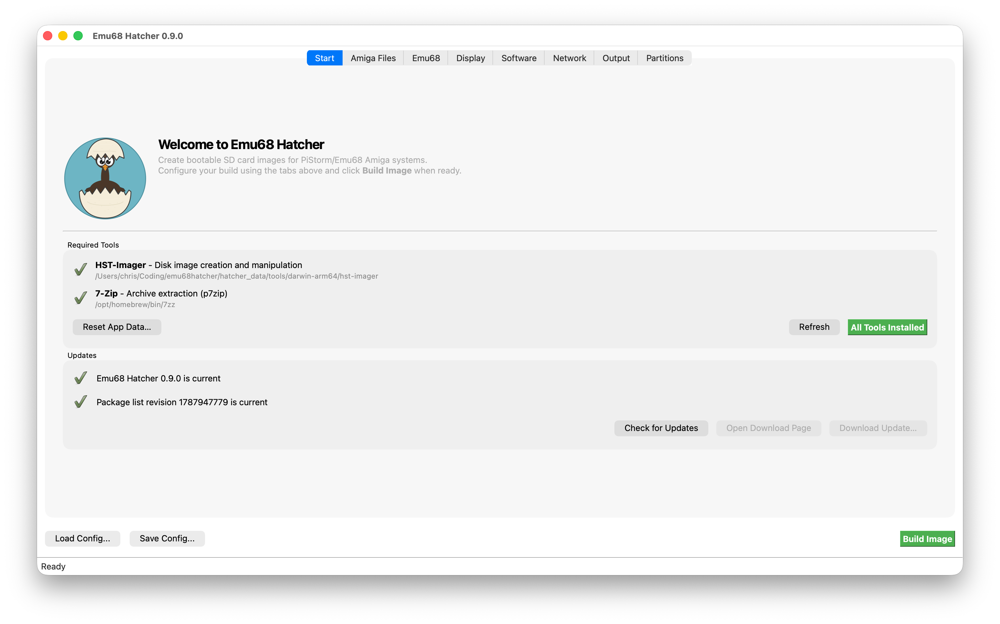
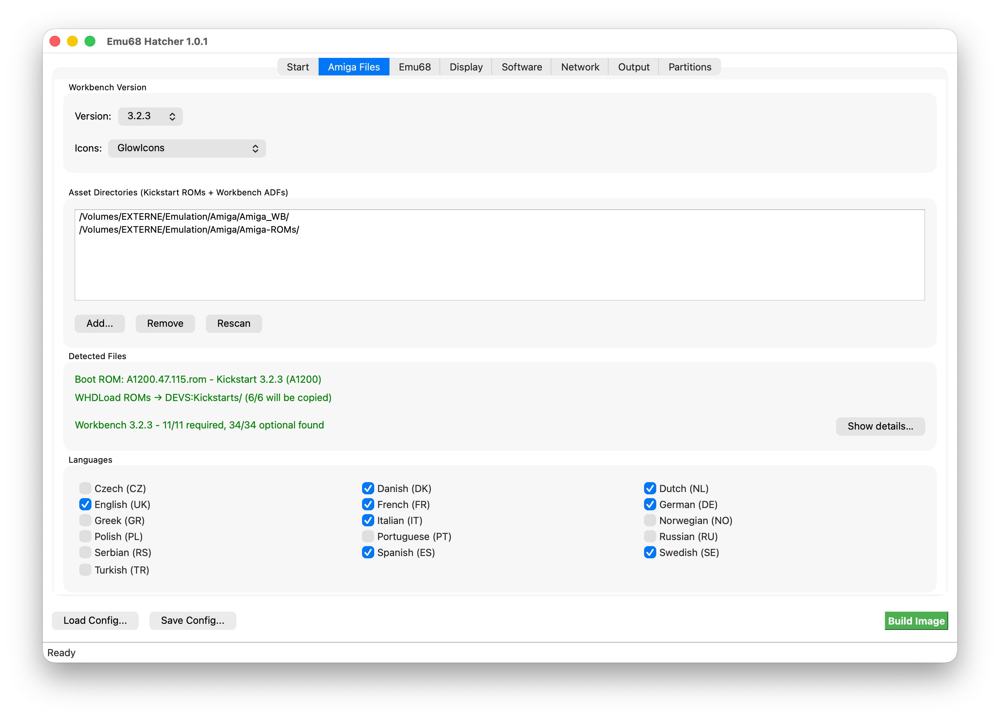
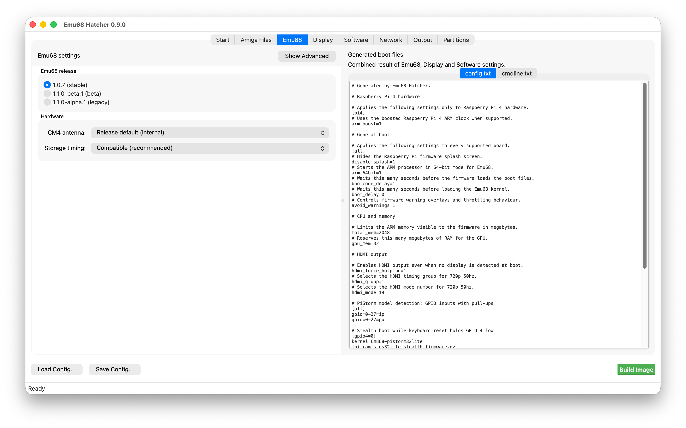
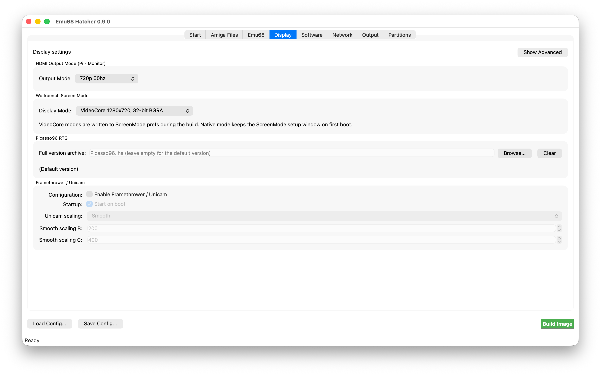
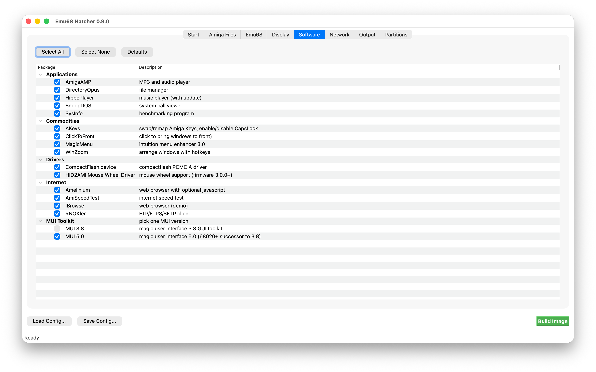
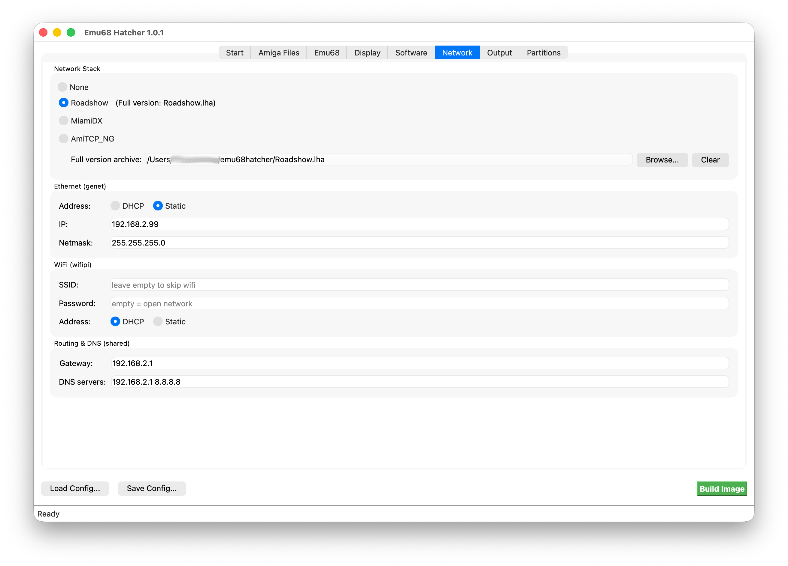
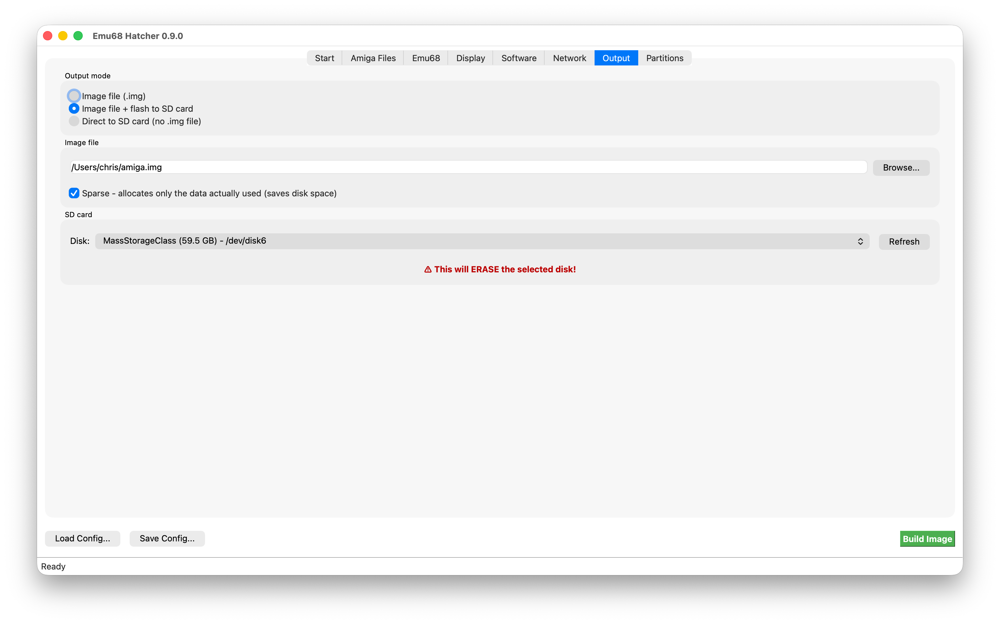
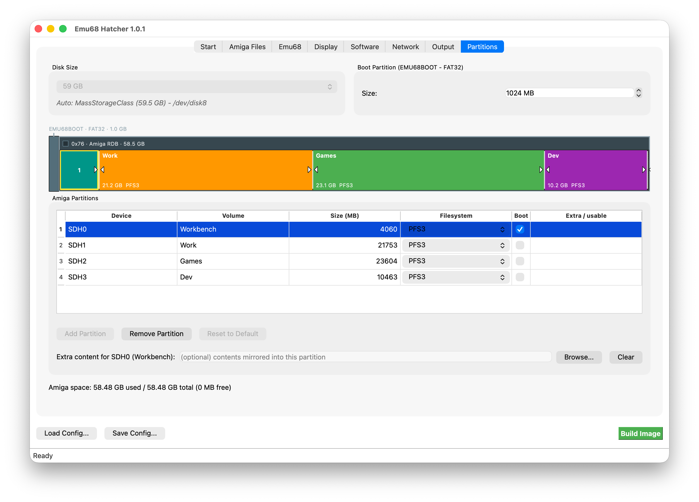

# Usage

## Build an image

1. **Launch the app.** It checks tools, updates and the package list.

2. **Start tab.** Download missing or outdated tools. App updates go to Downloads and can be opened after verification; on Linux this needs a Debian-based system.

    { target="_blank" }

3. **Amiga Files tab.** Add folders with a Kickstart ROM and Workbench ADFs, then pick version, icon set and languages. Files are matched by hash; **Show details...** lists what was found. AmigaOS 3.9 uses the CD **.iso** and a Kickstart 3.1 ROM instead. GlowIcons needs its matching ADF.

    { target="_blank" }

4. **Emu68 tab.** Pick 1.0.7 stable or 1.1.0-beta.1 and set boot options. The right side previews **config.txt** and **cmdline.txt**; more settings are under **Show Advanced**.

    { target="_blank" }

5. **Display tab.** Set HDMI and Workbench modes, Picasso96, Framethrower and Unicam. Use **Browse...** for your own full **Picasso96.lha**.

    { target="_blank" }

6. **Software tab.** Select optional software and hardware drivers. The list is filtered for the chosen Workbench and Emu68 versions. Required dependencies show which package needs them; libraries are grouped in a collapsed section. MUI is optional unless an application needs it. See [Packages](packages.md) for all packages.

    **Minimal** clears optional software and drivers and sets the Network tab to None. The OS, RTG, filesystem and FirstBoot helpers remain installed, including fat95 for access to the boot partition. ROM, display mode, partitions, icons and install media stay unchanged. Extra content is still copied, so those folders can add software to a minimal image.

    **Select None** clears only software choices; a selected network stack can still require drivers and libraries. **Defaults** restores the standard software selection without changing the Network tab. Save Config stores your choices separately from automatically required packages.

    Emu68 tools and drivers can be selected separately: Ethernet, WiFi, USB, NVMe, I2C clock support and diagnostic tools. A selected network stack includes both Ethernet and WiFi support. USB and NVMe components are offered only for compatible Emu68 versions. The Minimal selection retains RTG support; it is not a native-only installation.

    { target="_blank" }

    The **Fonts** group has four optional packs: Workbench (Apparent, Dina, Terminus), MagicWB (XEN, XHelvetica, XCourier), Retro, and Scalable (Bitstream Vera, DejaVu, Roboto). Sizes and styles are included with each pack. Installing a pack does not change the active Workbench, system or screen font.

    TrueType packs also install **ttf.library** and register their fonts during the first boot. Font readmes and supplied licenses are copied to **SYS:Emu68-Hatcher/Fonts/**. Downloads come from the original sources, not from CaffeineOS. MagicWB is shareware; its license requires registration after the evaluation period and does not permit separate redistribution of its fonts.

7. **Network tab.** Choose Roadshow, MiamiDX or AmiTCP_NG and enter DHCP, static or wifi settings. Roadshow archives and MiamiDX registration files can be supplied here. Connections start from the Workbench tools.

    { target="_blank" }

8. **Output tab.** Pick how to deliver the build:

    - **Image file** - writes a sparse **.img**.
    - **Image file + flash to SD card** - keeps the image and then flashes it; fastest for large builds.
    - **Direct to SD card** - skips the image, but is slower with large partitions.

    !!! danger "Double-check the target!"
        **Picking the wrong disk will wipe it.** Emu68 Hatcher will refuse to write to mounted root partitions (=your operating system) but has no problem with wiping anything else you have connected.

    { target="_blank" }

9. **Partitions tab.** Add or resize partitions and optional extra-content folders. Default is a 64 GB image with 1 GB **EMU68BOOT**, about 1/15 for Workbench and **Work** using the rest. FAT32 and RDB use two MBR entries; the listed Amiga partitions are inside the RDB.

    Extra content is copied last and can overwrite generated files.

    { target="_blank" }

10. **Click "Build Image".** The first build downloads packages; later builds use the cache. The dialog and **buildlog.txt** contain the build log.

Flashing asks for admin access. On macOS, hst-imager also needs Full Disk Access; see [Installation](installation.md#macos).

## Save / load configuration

Use **Save Config...** and **Load Config...** for JSON configs. wifi credentials are not saved.
